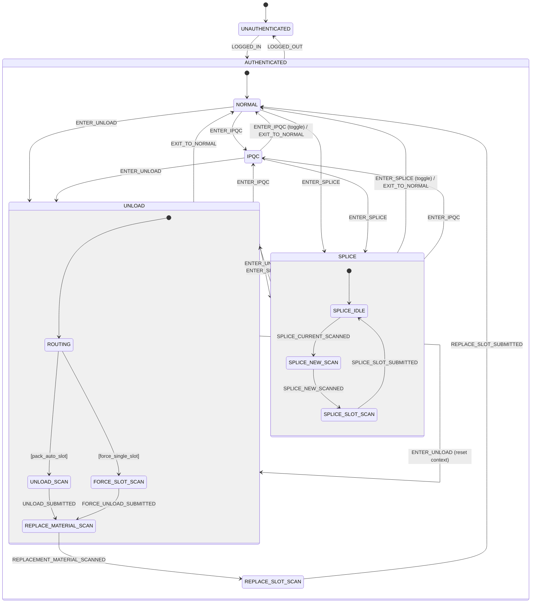

# Operation Mode State Machine

`operationModeStateMachine` 管理 Fuji / Panasonic 生產頁面的操作模式，
用 XState v5 取代原本散落的 `isUnloadMode` / `isIpqcMode` / `unloadReplacePhase` boolean 組合。

## 狀態圖



## 狀態說明

| 狀態 | 說明 |
|---|---|
| `UNAUTHENTICATED` | 未登入，無法進行任何操作 |
| `AUTHENTICATED` | 已登入（包含所有操作模式） |
| `AUTHENTICATED.NORMAL` | 預設正常上料接料模式 |
| `AUTHENTICATED.IPQC` | IPQC 覆檢模式，掃料確認正確性 |
| `AUTHENTICATED.UNLOAD` | 卸料/換料複合狀態 |
| `AUTHENTICATED.UNLOAD.UNLOAD_SCAN` | 掃卸除捲號（自動定位站位） |
| `AUTHENTICATED.UNLOAD.FORCE_SLOT_SCAN` | 直接掃站位強制卸除 |
| `AUTHENTICATED.UNLOAD.REPLACE_MATERIAL_SCAN` | 掃更換捲號 |
| `AUTHENTICATED.UNLOAD.REPLACE_SLOT_SCAN` | 掃原站位確認換料完成 |
| `AUTHENTICATED.SPLICE` | 接料複合狀態 |
| `AUTHENTICATED.SPLICE.SPLICE_IDLE` | 等待掃目前捲號 |
| `AUTHENTICATED.SPLICE.SPLICE_NEW_SCAN` | 等待掃新捲號 |
| `AUTHENTICATED.SPLICE.SPLICE_SLOT_SCAN` | 等待確認站位 |

## Context

```typescript
type OperationModeContext = {
  unloadModeType: "pack_auto_slot" | "force_single_slot"
  resolvedUnloadSlotIdno: string        // UNLOAD_SUBMITTED 後寫入
  replacementMaterialPackCode: string   // REPLACEMENT_MATERIAL_SCANNED 後寫入
  spliceSlotIdno: string                // SPLICE_CURRENT_SCANNED 後寫入
  spliceNewPackCode: string             // SPLICE_NEW_SCANNED 後寫入
}
```

Input form 值（`unloadMaterialValue`、`unloadSlotValue`）不放 context，仍用 Vue `ref` 綁 v-model。

## Auth 橋接

登入狀態由 `useOperationModeStateMachine` composable 橋接：
- 初始化時若 `authStore.isLoggedIn = true`，立即送 `LOGGED_IN`
- 監聽 `authStore.isLoggedIn` 變化，自動送 `LOGGED_IN` / `LOGGED_OUT`
- `operationModeStateMachine.ts` 本身不 import Pinia，保持純 domain

## 觸發碼對應

| 掃碼 | 動作 |
|---|---|
| `S5555` | `ENTER_UNLOAD` modeType=`pack_auto_slot` |
| `S5577` | `ENTER_UNLOAD` modeType=`force_single_slot` |
| `S5588` | `ENTER_IPQC`（再掃一次 toggle 退出） |
| `S5566` | `EXIT_TO_NORMAL` |
| `S1111` | 切換操作員（`handleUserSwitchTrigger`） |
